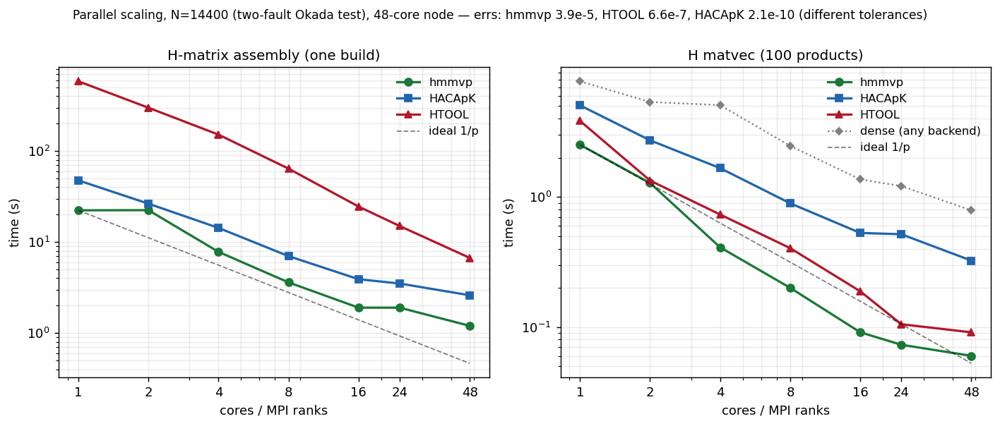

# Testing H-matrix backends with `compress_interaction_matrix`

`compress_interaction_matrix` builds the (strike-stress, by default)
fault interaction operator twice — once dense, once with a hierarchical
matrix backend constructed from the *same* Green's function kernel —
and compares the two for the forward product `b = A x` (always) and
optionally the inverse solve `x = A\b`. It is the fast way to choose
H-matrix settings for a given geometry before committing to long
`rsf_solve` runs.

All results below: two vertical fault groups offset by one x unit
(`makefault -n .. -m ..`, see below), half-space Okada rectangles,
June 2026; tests cover serial as well as MPI- and OpenMP-parallel
execution (see the parallel sections below). Errors are relative
two-norm differences against the dense operator.

This document and the associated benchmarks were generated by Claude
(Anthropic) in collaboration with Thorsten Becker; performance
numbers reflect the particular test geometry, tolerances, and
machines used, and other use cases may well lead to different
relative performance - the recommendations below are starting points,
not verdicts.

## Build requirements

| backend | `-use_hmatrix` | needs |
|---|---|---|
| dense | (always built) | PETSc |
| HTOOL | 1 (default) | PETSc configured `--download-htool`, compile with `-DUSE_PETSC_HMAT` (`PETSC_HTOOL_USED` in `makefile.petsc`) |
| H2OPUS | 2 | PETSc configured `--download-h2opus --download-thrust` (CPU), same define |
| HACApK | 3 | (the H-matrix library of ppOpen-HPC, also used by HBI, see References) `cd HACApK/v.1.0.0/C_interface; make; ar rcs libhacapk.a m_*.o HACApK_*.o`, then `HACAPK_DEFINES = -DUSE_HACAPK` and `HACAPK_LIBS` in `makefile.petsc`. **Build the library with `-O3`** (`OPT` in its Makefile): the unoptimized build has a ~13x slower matvec. **The library MUST be compiled with the same MPI implementation as PETSc** (otherwise `HACApK_init` fails with `MPI_Comm_size failed`): use the wrappers PETSc reports, `pkg-config --variable=fcompiler PETSc`, or `$PETSC_DIR/$PETSC_ARCH/bin/mpifort` for `--download-mpich` builds. |
| hmmvp | 4 | clone https://github.com/ambrad/hmmvp ; create make.inc (CPP/BLAS/LAPACK), add `-std=c++14` to `opt`, `mode = omp`, `mkdir lib bin`, `make`; set `HMMVP_DIR/HMMVP_DEFINES/HMMVP_INC/HMMVP_LIBS` in `makefile.petsc` (links the C++ shim `hmmvp_c_shim.cpp`). EPL-1.0 licensed. |

PETSc example configure for everything at once:

    ./configure --with-debugging=0 --with-cc=mpicc --with-cxx=mpicxx \
      --with-fc=0 --download-htool --download-h2opus --download-thrust \
      COPTFLAGS=-O2 CXXOPTFLAGS=-O2

## Test geometry

    makefault -n 20 -m 10           >  geom.in   # fault group 0
    makefault -n 20 -m 10 -x 1 -grp 1 >> geom.in # group 1, offset
    # -n 20 -m 10  -> N=400; 40/20 -> 1600; 80/40 -> 6400; 100/50 -> 10000

## Command lines

Forward accuracy (error is always printed; `-mat_view ::ascii_info`
adds the htool compression report):

    compress_interaction_matrix -geom_file geom.in -use_hmatrix 1 \
        -mat_htool_epsilon 3e-5 -mat_htool_eta 10        # HTOOL
    compress_interaction_matrix -geom_file geom.in -use_hmatrix 2 \
        -mat_h2opus_maxrank 256                          # H2OPUS
    compress_interaction_matrix -geom_file geom.in -use_hmatrix 3 \
        -hacapk_ztol 1e-5                                # HACApK
    compress_interaction_matrix -geom_file geom.in -use_hmatrix 4 \
        -hmmvp_tol 1e-6 -hmmvp_nthreads 4                # hmmvp

Matvec timing (adds n random-vector multiplies, timed for dense and H):

    compress_interaction_matrix -geom_file geom.in -use_hmatrix 3 \
        -hacapk_ztol 1e-5 -nrandom 300

Inverse solve test (dense LU vs unpreconditioned KSP on the H operator):

    compress_interaction_matrix -geom_file geom.in -use_hmatrix 1 \
        -mat_htool_epsilon 3e-5 -mat_htool_eta 10 -test_forward false

Assembly times for the dense and the H matrix are printed on stderr
("dense assembly took", "H matrix assembly took").

## Accuracy: error vs tolerance setting

Forward `b = Ax`, error tracks the tolerance for HTOOL and HACApK:

| setting | N=400 | N=1600 | N=6400 | N=10000 |
|---|---|---|---|---|
| HTOOL eps 1e-3 (ACA) | 5.8e-4* | 5.8e-4 | — | — |
| HTOOL eps 1e-4 (ACA, eta 100) | — | 7.0e-5 | 2.1e-4 | — |
| HTOOL eps 3e-5 (ACA, eta 10) | — | 3.2e-7 | 5.8e-7 | 8.8e-6 |
| HTOOL eps 1e-8 | 1e-15 (= dense) | — | — | — |
| H2OPUS (maxrank 256) | 2.3e-3 | 2.3e-3 | 2.6e-3 | — |
| HACApK ztol 1e-4 | 2.0e-6 | 4.7e-6 | — | 1.8e-5 |
| HACApK ztol 1e-5 | — | 2.5e-7 | 3.5e-7 | 6.2e-7 |
| hmmvp tol 1e-5 | 7.3e-6 | 3.3e-5 | 1.6e-4 | — |
| hmmvp tol 1e-6 | — | — | 1.1e-5 | — |

hmmvp's -hmmvp_tol is a WHOLE-MATRIX relative Frobenius bound
(the MREM method) - the only backend whose tolerance directly bounds
a global error. note that the x=1 test vector used for the error rows
above suffers cancellation in the row sums of this sign-structured
kernel, which inflates the measured relative error somewhat above the
operator-norm error for all backends alike.

(*N=400 value at eta=100; the eps 1e-3 row is representative.)

Inverse `x = A\b` (N=1600, vs dense LU): HTOOL 5.1e-6 (recommended
config), hmmvp 1.9e-6 (tol 1e-6), HACApK works through the same
KSP/MATSHELL path, H2OPUS 8.1e-4 (floor, see below).

## Performance (300 matvecs; assembly of one H matrix)

| N=10000 | err | H assembly | matvec total | vs dense matvec |
|---|---|---|---|---|
| dense | — | ~85 s | 25.6 s | 1x |
| HTOOL (ACA eps 3e-5, eta 10) | 8.8e-6 | ~19 s | 6.6 s | 3.9x |
| **HACApK ztol 1e-5** | **6.2e-7** | **11.7 s** | **3.8 s** | **6.7x** |
| hmmvp tol 1e-6 (N=6400) | 1.1e-5 | 7.3 s | 1.5 s/300 | fastest matvec at 6400 |
| HACApK ztol 1e-4 | 1.8e-5 | 9.0 s | 2.9 s | 8.8x |

Speedups grow with N (HTOOL matvec: 1.7x at N=1600, 3.5-8x at 6400);
dense matvec scales N^2, the H backends ~N log N.

## Measured parallel scaling (48-core node, N=14400, 100 matvecs)

All three backends now run their *native* distributed/parallel path:
HTOOL and HACApK over MPI ranks, and hmmvp over MPI ranks via the
file-based `MpiHmat` workflow (compress-to-file, then a collective
`MpiHmat` matvec - see the MPI status section). `OPENBLAS_NUM_THREADS=1`
throughout (threaded BLAS nested inside block-level parallelism
thrashes). Times are wall-clock seconds: assembly of one H matrix, and
the total for 100 H matvecs. `err` is the relative two-norm vs dense,
which was rank-invariant for every backend across the whole sweep.

| cores | hmmvp asm / mv_H | HACApK asm / mv_H | HTOOL asm / mv_H |
|---|---|---|---|
| 1  | 22.3 / 2.522 | 47.6 / 5.070 | 583.8 / 3.851 |
| 2  | 22.4 / 1.281 | 26.4 / 2.729 | 299.1 / 1.338 |
| 4  |  7.8 / 0.410 | 14.3 / 1.667 | 151.4 / 0.733 |
| 8  |  3.6 / 0.200 |  7.0 / 0.894 |  64.0 / 0.404 |
| 16 |  1.9 / 0.091 |  3.9 / 0.529 |  24.5 / 0.188 |
| 24 |  1.9 / 0.073 |  3.5 / 0.517 |  15.0 / 0.105 |
| 48 |  1.2 / 0.060 |  2.6 / 0.324 |   6.7 / 0.091 |
| **err** | **3.9e-5** | **2.1e-10** | **6.6e-7** |

(dense matvec, the shared baseline, is backend-independent: 7.76 / 5.38
/ 5.09 / 2.47 / 1.37 / 1.21 / 0.79 s at 1..48 cores.)

Reading this table fairly requires one caveat up front: **the three
backends are at very different achieved accuracies** (2.1e-10 to 3.9e-5,
~5 orders apart), because each was run at its own recommended tolerance
and those knobs are not comparable (hmmvp's whole-matrix Frobenius bound
vs HACApK `ztol` vs HTOOL `eps`). Tighter tolerance stores more entries
and slows the matvec, so part of any speed difference is bought with
accuracy; a matched-error comparison would narrow the gaps below.

Observations, for this geometry and machine:

- **hmmvp** (MPI `MpiHmat` path) had the lowest assembly *and* lowest
  matvec time at every core count here, scaling ~19x (assembly) and ~42x
  (matvec, slightly superlinear from cache effects as the per-rank block
  set shrinks) to 48 cores. This is also the loosest-tolerance run
  (3.9e-5), so the speed is partly an accuracy trade; it is nonetheless
  the configuration to beat when a ~1e-5 global error is acceptable.
  Assembly is master/worker (rank 0 manages, ranks 1..np-1 compress), so
  np=2 ~ serial (22.3 -> 22.4: one worker) and effective parallelism is
  np-1; the matvec uses all ranks and scales from np=2.
- **HACApK** was the most accurate by a wide margin (2.1e-10,
  bit-identical across all rank counts), with assembly scaling well; its
  matvec is the slowest of the three and goes comm-bound beyond ~16
  ranks (0.529 -> 0.517 s from 16 -> 24), the gather + ring-exchange
  limit noted earlier.
- **HTOOL** has by far the most expensive assembly (a build-once,
  reuse-many proposition) but it scales steeply and its matvec is
  competitive with hmmvp's at high rank counts; accuracy sits between
  the other two and varies slightly per rank count (its block partition
  changes with the decomposition).

So the earlier note that "hmmvp's matvec does not scale" applied to the
*in-memory OpenMP* path; the *MPI `MpiHmat`* path measured here does
scale. The practical split for this test: hmmvp when a ~1e-5 global
error is fine and both build and matvec speed matter; HACApK when high
accuracy or a deterministic, rank-invariant operator is the priority;
HTOOL when the build cost can be amortized over very many matvecs. As
always this can shift with geometry, problem size, tolerance, and
hardware - rerun `hmat_scaling_test.sh` for your own configuration.

## Recommended settings

- **hmmvp (`-use_hmatrix 4`)**: in the N=14400 MPI scaling test above it
  had the lowest assembly *and* matvec time of the three backends at
  every core count - though at the loosest accuracy (3.9e-5 at tol 1e-5),
  so that ranking is partly an accuracy trade and would tighten under a
  matched-error comparison. Two distinguishing features: the whole-matrix
  Frobenius tolerance (-hmmvp_tol sets the global operator error
  directly) and two parallel modes - OpenMP-threaded in-memory
  construction/matvec (-hmmvp_nthreads), and the MPI `MpiHmat` path
  (compress-to-file + collective distributed matvec) that is what scales
  across ranks in the table above. -hmmvp_eta (default 3) is the
  admissibility.
  THREAD SAFETY: dc3d.F now carries !$OMP THREADPRIVATE COMMON blocks,
  making the rectangular Okada kernel chain thread safe - PROVIDED
  dc3d.F is compiled with -fopenmp (FFLAGS) and binaries link with
  -fopenmp (LDFLAGS); without the flag the directives are comments
  and concurrent kernel calls silently corrupt entries (use
  ifort/-qopenmp equivalents on other compilers). serial results are
  bit-identical to the original. validated: hmmvp threaded
  compression without any kernel mutex gives serial-class errors at
  1/2/4 threads, and interact's dc3d agrees with HBI's f90 rewrite
  (mod_okada) to 3e-16 over 216 test configurations for strike and
  dip slip - HBI's version omits the tensile (opening) terms
  (dd3 commented out) and has no DC3D0 point source, so interact's
  THREADPRIVATE dc3d.F is the more general implementation at
  identical speed. triangular element routines remain unaudited for
  thread safety. building WITHOUT -fopenmp remains fully safe for
  serial and pure-MPI use (COMMON blocks are per process; MPI ranks
  never shared them) and costs nothing; a runtime sentinel
  (DC3DTS() in dc3d.F, true only when the THREADPRIVATE directives
  are active) lets threaded callers verify the build: the tool
  refuses -hmmvp_nthreads > 1 with a clear message instead of
  silently corrupting if dc3d.F was compiled without the flag.
  measured THREADPRIVATE overhead on 5e5 kernel calls: < 1 percent
  (0.713 / 0.719 / 0.722 s for original / directives-inactive /
  directives-active builds, identical checksums).
- **HACApK (`-use_hmatrix 3`) performed best for this operator in our
  serial tests**:
  index-based kernel interface, robust default ACA (no reliability
  tuning needed; `param(61)=1` normalization is set by the interface),
  fastest assembly and matvec at matched error. Use `-hacapk_ztol`
  ~3-10x below the error target (1e-5 gives <1e-6 everywhere tested).
- **HTOOL (`-use_hmatrix 1`)**: use `sympartialACA` (default) with
  **eta = 10 (default)** and eps ~3x below the target. Caution: large
  eta (e.g. 100) compresses better but partial-pivoting ACA can
  mis-converge on big marginally-separated blocks (the kernel's
  quadrant sign structure produces near-zero pivot rows): at N=10000,
  eps 3e-5 gave 3.1e-4 with eta=100 vs 8.8e-6 with eta=10. The
  reliable eta=10 costs more assembly (70 s vs 10 s at N=6400). The
  fullACA/SVD compressors are reliable and compress best but have
  O(N^2) assembly — only for operators reused over >~1e5 matvecs.
- **H2OPUS (`-use_hmatrix 2`)**: construction is via sampling of the
  assembled dense operator (`MatCreateH2OpusFromMat`), because the
  kernel interface (Chebyshev interpolation at arbitrary points) is
  incompatible with patch-pair Green's functions. **This h2opus only
  implements sampling construction for SYMMETRIC matrices** (a warning
  is printed): the result approximates (K+K^T)/2, and the measured
  operator asymmetry |K-K^T|/|K| ~ 4-8e-4 is an irreducible error
  floor (~2.5e-3 in the matvec). Needs `-mat_h2opus_maxrank 256` for
  N >= 1600 (the default 64 truncates and *wastes* memory). Fine for
  symmetric problems; not for this operator.
## Serial vs parallel testing

Run the same command serially and under MPI and compare the printed
relative error and timings; the dense baseline is rebuilt (distributed)
in every run, so each invocation is self-checking:

    # serial reference
    compress_interaction_matrix -geom_file geom.in -use_hmatrix 1 -nrandom 300
    # same thing on 2 and 4 ranks
    mpirun -np 2 compress_interaction_matrix -geom_file geom.in -use_hmatrix 1 -nrandom 300
    mpirun -np 4 compress_interaction_matrix -geom_file geom.in -use_hmatrix 1 -nrandom 300

    # HACApK: error should be BIT-IDENTICAL across np (deterministic construction)
    mpirun -np 2 compress_interaction_matrix -geom_file geom.in -use_hmatrix 3 -hacapk_ztol 1e-5
    mpirun -np 4 compress_interaction_matrix -geom_file geom.in -use_hmatrix 3 -hacapk_ztol 1e-5

    # H2OPUS: serial only; at np>1 the tool exits with a clear message
    mpirun -np 2 compress_interaction_matrix -geom_file geom.in -use_hmatrix 2

What to expect: HTOOL errors stay within the epsilon class but differ
per rank count (the block partition changes); HACApK errors are
bit-identical to serial; the inverse test (-test_forward false) also
runs in parallel through the same KSP machinery. On a machine with
fewer cores than ranks add `--oversubscribe` (OpenMPI); correctness
can be tested that way, timing cannot.

## MPI parallel status (tested serial, np=2, np=4 at N=400)

| backend | parallel `b = Ax` | notes |
|---|---|---|
| dense | works | distributed rows, exercised as the baseline in every run |
| HTOOL | works | error stays in the eps class but differs per np (different block partition): 8.4e-5 / 1.1e-4 / 5.5e-5 at np=1/2/4, eps 1e-3 |
| H2OPUS | **serial only** | `MatCreateH2OpusFromMat` sampling unsupported in parallel in this PETSc/h2opus; the tool exits with a clear message at np>1 |
| hmmvp | works (distributed) | under MPI, `-use_hmatrix 4` uses hmmvp's `MpiHmat`: each rank compresses its blocks to a per-rank scratch file, the root concatenates them into one `.hm`, and the load hands each rank its block subset for a collective matvec (gather `x` to root, per-rank block products, reduce). Error is rank-invariant (3.9e-5 at tol 1e-5) across np and the path scales (see the scaling section). np=1 is the serial in-memory build; the OpenMP-threaded in-memory matvec is the separate non-MPI path. Build note: the shim must see hmmvp's own `UTIL_MPI` (it maps `USE_HMMVP_MPI` onto it), or the `MpiHmat`/`mpi::Send/Recv` templates instantiate as no-op stubs and np>=2 fails. inverse test verified at 1.9e-6 (tol 1e-6, N=1600) |
| HACApK | works | **bit-identical to serial at np=2 and np=4** (1.16e-7 at ztol 1e-5): deterministic construction, only the leaf work distribution changes. the MATSHELL gathers x to all ranks (HACApK's adot needs global vectors and returns the global result on each rank) |

- Context for the error target: in quasi-dynamic `rsf_solve` cycles,
  operator errors ~1e-4 shift event onsets by O(100 s) and can
  restructure two-fault rupture sequences; ~1e-6 reproduces dense
  onsets to ~5e-4 s. The H2OPUS floor is therefore not
  production-viable for earthquake cycles, while HTOOL at eps 1e-6
  and HACApK at ztol 1e-5..1e-6 are.

## References

- HTOOL: P. Marchand et al., via PETSc (`--download-htool`),
  https://github.com/htool-ddm/htool
- H2OPUS: S. Zampini et al., via PETSc (`--download-h2opus`),
  https://github.com/ecrc/h2opus
- HACApK: T. Ida et al., ppOpen-HPC project; the version used here
  follows the v1.0.0 sources; HACApK is also the H-matrix engine of
  HBI (So Ozawa and co-workers), see
  https://github.com/sozawa94/hbi and in particular
  https://github.com/sozawa94/hbi/blob/master/HACApK_lib.f90
- hmmvp: A. M. Bradley, Hierarchical matrix-vector products,
  https://github.com/ambrad/hmmvp (EPL-1.0)
- HBI: boundary integral earthquake cycle code by So Ozawa et al.,
  https://github.com/sozawa94/hbi - used as a reference point for the
  rate-and-state solver comparisons and for the thread-safe Okada
  validation (see the thread safety notes above)
- Okada, Y. (1992), Internal deformation due to shear and tensile
  faults in a half-space, BSSA 82, 1018-1040 (dc3d.F)
